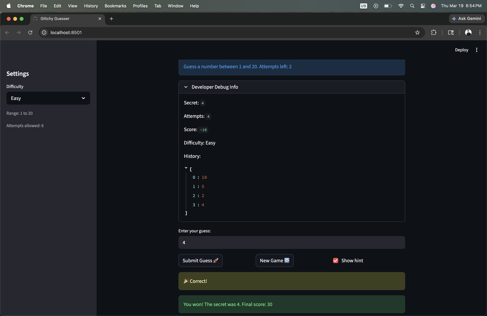
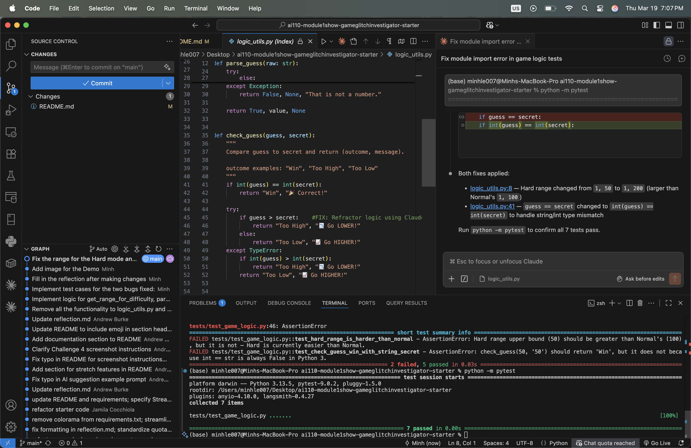

# 🎮 Game Glitch Investigator: The Impossible Guesser

## 🚨 The Situation

You asked an AI to build a simple "Number Guessing Game" using Streamlit.
It wrote the code, ran away, and now the game is unplayable. 

- You can't win.
- The hints lie to you.
- The secret number seems to have commitment issues.

## 🛠️ Setup

1. Install dependencies: `pip install -r requirements.txt`
2. Run the broken app: `python -m streamlit run app.py`

## 🕵️‍♂️ Your Mission

1. **Play the game.** Open the "Developer Debug Info" tab in the app to see the secret number. Try to win.
2. **Find the State Bug.** Why does the secret number change every time you click "Submit"? Ask ChatGPT: *"How do I keep a variable from resetting in Streamlit when I click a button?"*
3. **Fix the Logic.** The hints ("Higher/Lower") are wrong. Fix them.
4. **Refactor & Test.** - Move the logic into `logic_utils.py`.
   - Run `pytest` in your terminal.
   - Keep fixing until all tests pass!

## 📝 Document Your Experience

- [ ] Describe the game's purpose.
+ The game want the player to guess the right number that they given before 
- [ ] Detail which bugs you found.
+ The bugs I found was the logic behind the hint when a player guess the number that is less than the secret number it should says "GO HIGHER" but it said "GO LOWER", and vice versa.
+ The second bugs I found was the range for each difficulty is default to be 1 to 100 
- [ ] Explain what fixes you applied.
+ For the first bug, I changed the string "GO HIGHER" after "Too High" to "GO LOWER, and vice versa
+ For the second bug, I changed the random.randint(1, 100) -> random.randint(low, high)

## 📸 Demo

- [] [Insert a screenshot of your fixed, winning game here]

## 🚀 Stretch Features

- [] [If you choose to complete Challenge 4, insert a screenshot of your Enhanced Game UI here]
